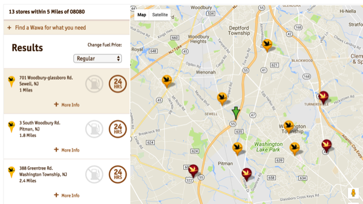
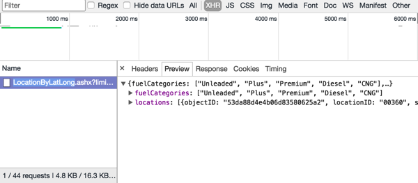
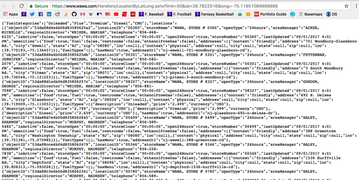

# WawaGeoScraper
Scraping Wawa data from the company's store locator page.


## Background
As any born-and-raised Delaware Valley citizen knows, Wawa (particularly
its coffee) is the life and blood of the region. To misquote [a certain 4chan
meme](http://knowyourmeme.com/memes/shrek-is-love-shrek-is-life): Wawa is love, Wawa is life.


&nbsp;&nbsp;&nbsp;&nbsp;&nbsp;&nbsp;&nbsp;&nbsp;&nbsp;&nbsp;&nbsp;&nbsp;&nbsp;&nbsp;&nbsp;&nbsp;&nbsp;&nbsp;&nbsp;&nbsp;&nbsp;&nbsp;&nbsp;&nbsp;&nbsp;&nbsp;&nbsp;&nbsp;&nbsp;&nbsp;&nbsp;&nbsp;&nbsp;

&nbsp;&nbsp;&nbsp;&nbsp;&nbsp;&nbsp;&nbsp;&nbsp;&nbsp;&nbsp;&nbsp;&nbsp;&nbsp;&nbsp;&nbsp;&nbsp;&nbsp;&nbsp;&nbsp;&nbsp;&nbsp;&nbsp;&nbsp;&nbsp;&nbsp;&nbsp;&nbsp;&nbsp;&nbsp;&nbsp;&nbsp;&nbsp;&nbsp;&nbsp;&nbsp;&nbsp;&nbsp;&nbsp;&nbsp;&nbsp;&nbsp;&nbsp;&nbsp;&nbsp;&nbsp;&nbsp;&nbsp;&nbsp;&nbsp;&nbsp;&nbsp;&nbsp;&nbsp;&nbsp;&nbsp;&nbsp;&nbsp;&nbsp;&nbsp;&nbsp;&nbsp;&nbsp;&nbsp;&nbsp;&nbsp;&nbsp;&nbsp;<i>The Pearly Gates for South Jerseyans</i>

### Previous attempts
As a computer programmer who works with GIS (Geographic Information Systems),
I've always wanted a good dataset containing Wawa locations. Previously,
I had used a csv found [at this weird, questionably credible site](http://daleswanson.blogspot.com/2009/07/wawa-locations-and-info.html)
that contained enough info for me to put it into a spatial database. However,
this was a stranger's old website that hadn't be updated since 2009. There
had to be a better way! I then stumbled upon [this site](https://www.aggdata.com/aggdata/complete-list-wawa-locations) which
tries to scam you into paying $90 for data that surely is available for free
somewhere.

### Custom Development
Alas, it looked like I would have to build a tool from scratch and scrape
the locations myself from Wawa's website. Many companies have store locators
and lists of stores available on their sites. For instance, [I was able to
quickly build a web-scraping script](https://github.com/cfh294/WebScraping) for Wawa's North Jersey counterpart QuickChek,
due to the incredibly easy to scrape design of [their website](http://quickchek.com/locations/).
Unfortunately, Wawa's site was not so forgiving. Unlike
QuickChek's site, Wawa's didn't list their locations, but rather made you
search.

&nbsp;&nbsp;&nbsp;&nbsp;&nbsp;&nbsp;&nbsp;&nbsp;&nbsp;&nbsp;&nbsp;&nbsp;&nbsp;&nbsp;&nbsp;&nbsp;&nbsp;&nbsp;&nbsp;&nbsp;&nbsp;&nbsp;&nbsp;&nbsp;&nbsp;&nbsp;&nbsp;&nbsp;&nbsp;&nbsp;&nbsp;&nbsp;&nbsp;

&nbsp;

However, even the resulting list wasn't that easy to scrape.
I couldn't get into the JavaScript that backed their map, so it looked like
I was stuck. I opened my inspector tools in Chrome and navigated to the
XMLHttpRequest tab and found that each time I clicked the search button with
a zip code entered, an http request was being fired that took
the calculated coordinates of my entered zip code (I assume they use the center
of the zip code's polygon) as arguments. This request returns a giant ugly
block of JSON containing Wawa data. After some messing around, I found that
the JSON was most likely returning all the Wawas within five miles of the
entered zip code.

&nbsp;

&nbsp;&nbsp;&nbsp;&nbsp;&nbsp;&nbsp;&nbsp;&nbsp;&nbsp;&nbsp;&nbsp;&nbsp;&nbsp;&nbsp;&nbsp;&nbsp;&nbsp;&nbsp;&nbsp;&nbsp;&nbsp;&nbsp;&nbsp;&nbsp;&nbsp;&nbsp;&nbsp;&nbsp;&nbsp;&nbsp;&nbsp;&nbsp;&nbsp;
&nbsp;&nbsp;&nbsp;&nbsp;&nbsp;&nbsp;&nbsp;&nbsp;&nbsp;&nbsp;&nbsp;&nbsp;&nbsp;&nbsp;&nbsp;&nbsp;&nbsp;&nbsp;&nbsp;&nbsp;&nbsp;&nbsp;&nbsp;&nbsp;&nbsp;&nbsp;&nbsp;&nbsp;&nbsp;&nbsp;&nbsp;&nbsp;&nbsp;&nbsp;&nbsp;&nbsp;&nbsp;&nbsp;&nbsp;&nbsp;&nbsp;&nbsp;&nbsp;&nbsp;&nbsp;&nbsp;&nbsp;&nbsp;&nbsp;&nbsp;&nbsp;&nbsp;&nbsp;&nbsp;&nbsp;&nbsp;&nbsp;&nbsp;&nbsp;&nbsp;&nbsp;&nbsp;&nbsp;&nbsp;&nbsp;&nbsp;&nbsp;&nbsp;<i>The XHR view in the "Inspect" window</i>
&nbsp;

&nbsp;&nbsp;&nbsp;&nbsp;&nbsp;&nbsp;&nbsp;&nbsp;&nbsp;&nbsp;&nbsp;&nbsp;&nbsp;&nbsp;&nbsp;&nbsp;&nbsp;&nbsp;&nbsp;&nbsp;&nbsp;&nbsp;&nbsp;&nbsp;&nbsp;&nbsp;&nbsp;&nbsp;&nbsp;&nbsp;&nbsp;&nbsp;&nbsp;
&nbsp;&nbsp;&nbsp;&nbsp;&nbsp;&nbsp;&nbsp;&nbsp;&nbsp;&nbsp;&nbsp;&nbsp;&nbsp;&nbsp;&nbsp;&nbsp;&nbsp;&nbsp;&nbsp;&nbsp;&nbsp;&nbsp;&nbsp;&nbsp;&nbsp;&nbsp;&nbsp;&nbsp;&nbsp;&nbsp;&nbsp;&nbsp;&nbsp;&nbsp;&nbsp;&nbsp;&nbsp;&nbsp;&nbsp;&nbsp;&nbsp;&nbsp;&nbsp;&nbsp;&nbsp;&nbsp;&nbsp;&nbsp;&nbsp;&nbsp;&nbsp;&nbsp;&nbsp;&nbsp;&nbsp;&nbsp;&nbsp;&nbsp;&nbsp;&nbsp;&nbsp;&nbsp;&nbsp;&nbsp;&nbsp;&nbsp;&nbsp;&nbsp;&nbsp;&nbsp;&nbsp;&nbsp;&nbsp;&nbsp;&nbsp;&nbsp;&nbsp;&nbsp;&nbsp;<i>The returned JSON data</i>

### Getting Somewhere
This XMLHttpRequest's url was the breakthrough I needed! ~~If I could make a grid
of points over the Mid-Atlantic region (and Florida--Wawa has stores there now!) with
points that were 5 miles apart in each direction, I could iterate through each point
and fire off a new url to grab all possible Wawas! I used a simply-built python
function to generate this grid, and I tested it on Florida. Sure enough,
it got exactly what I needed. The rest of my code broke down the JSON data
and formatted it as field values in a database table. Each record was now represented
by a Python list object (or array). I shoved these new rows into a database table
using Python and SQL, and then used PostGIS functions to calculate the actual
geometry of each Wawa store's location.~~

<b>2019 UPDATE</b>

After additional testing, I was able to find another endpoint that allows me to 
search by store id. While I don't have a a list of store ids, I have a much better
rough estimate of a range of integers for store ids that I can use to get all of the 
Wawas, rather than cast wide geographic nets to grab them. This new method is in the 
updated code and is <i>much</i> more straight forward. 


### Results
The result of all of this was a surprisingly detailed table containing specific
information such as manager names, store hours, and even individual gasoline type
prices as of the last update. [I have exported this to csv](output/locations_2019.csv) and have 
made the data available [as a shapefile](output/wawas_shapefile_2019.zip) as well.


#### Command line example
```Shell

pip3 install -r requirements.txt

python3 wawa_to_csv.py /location/of/output.csv

# with limit
python3 wawa_to_csv.py /location/of/output.csv --limit 50
```
