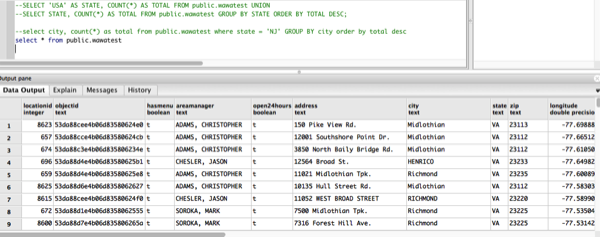

# WawaGeoScraper
Scraping Wawa data from the company's store locator page.

<b>***If you don't feel like reading and just want the data, just click
[this link](https://www.dropbox.com/s/6qaibtwee8syinm/WawaData.zip?dl=1) to download
the shapefile and csv</b>

## Background
As any born-and-raised Delaware Valley citizen knows, Wawa (particularly
its coffee) is the life and blood of the region. To misquote [a certain 4chan
meme](http://knowyourmeme.com/memes/shrek-is-love-shrek-is-life): Wawa is love, Wawa is life.


&nbsp;&nbsp;&nbsp;&nbsp;&nbsp;&nbsp;&nbsp;&nbsp;&nbsp;&nbsp;&nbsp;&nbsp;&nbsp;&nbsp;&nbsp;&nbsp;&nbsp;&nbsp;&nbsp;&nbsp;&nbsp;&nbsp;&nbsp;&nbsp;&nbsp;&nbsp;&nbsp;&nbsp;&nbsp;&nbsp;&nbsp;&nbsp;&nbsp;

&nbsp;&nbsp;&nbsp;&nbsp;&nbsp;&nbsp;&nbsp;&nbsp;&nbsp;&nbsp;&nbsp;&nbsp;&nbsp;&nbsp;&nbsp;&nbsp;&nbsp;&nbsp;&nbsp;&nbsp;&nbsp;&nbsp;&nbsp;&nbsp;&nbsp;&nbsp;&nbsp;&nbsp;&nbsp;&nbsp;&nbsp;&nbsp;&nbsp;&nbsp;&nbsp;&nbsp;&nbsp;&nbsp;&nbsp;&nbsp;&nbsp;&nbsp;&nbsp;&nbsp;&nbsp;&nbsp;&nbsp;&nbsp;&nbsp;&nbsp;&nbsp;&nbsp;&nbsp;&nbsp;&nbsp;&nbsp;&nbsp;&nbsp;&nbsp;&nbsp;&nbsp;&nbsp;&nbsp;&nbsp;&nbsp;&nbsp;&nbsp;<i>The Pearly Gates for South Jerseyans</i>

### Previous attempts
As a computer programmer who works with GIS (Geographic Information Systems),
I've always wanted a good dataset containing Wawa locations. Previously,
I had used a csv found [at this weird, questionably credible site](http://daleswanson.blogspot.com/2009/07/wawa-locations-and-info.html)
that contained enough info for me to put it into a spatial database. However,
this was a stranger's old website that hadn't be updated since 2009. There
had to be a better way! I then stumbled upon [this site](https://www.aggdata.com/aggdata/complete-list-wawa-locations) which
tries to scam you into paying $90 for data that surely is available for free
somewhere.

### Custom Development
Alas, it looked like I would have to build a tool from scratch and scrape
the locations myself from Wawa's website. Many companies have store locators
and lists of stores available on their sites. For instance, [I was able to
quickly build a web-scraping script](https://github.com/cfh294/WebScraping) for Wawa's North Jersey counterpart QuickChek,
due to the incredibly easy to scrape design of [their website](http://quickchek.com/locations/).
Unfortunately, Wawa's site was not so forgiving. Unlike
QuickChek's site, Wawa's didn't list their locations, but rather made you
search.

&nbsp;&nbsp;&nbsp;&nbsp;&nbsp;&nbsp;&nbsp;&nbsp;&nbsp;&nbsp;&nbsp;&nbsp;&nbsp;&nbsp;&nbsp;&nbsp;&nbsp;&nbsp;&nbsp;&nbsp;&nbsp;&nbsp;&nbsp;&nbsp;&nbsp;&nbsp;&nbsp;&nbsp;&nbsp;&nbsp;&nbsp;&nbsp;&nbsp;

&nbsp;

However, even the resulting list wasn't that easy to scrape.
I couldn't get into the JavaScript that backed their map, so it looked like
I was stuck. I opened my inspector tools in Chrome and navigated to the
XMLHttpRequest tab and found that each time I clicked the search button with
a zip code entered, an http request was being fired that took
the calculated coordinates of my entered zip code (I assume they use the center
of the zip code's polygon) as arguments. This request returns a giant ugly
block of JSON containing Wawa data. After some messing around, I found that
the JSON was most likely returning all the Wawas within five miles of the
entered zip code.

&nbsp;

&nbsp;&nbsp;&nbsp;&nbsp;&nbsp;&nbsp;&nbsp;&nbsp;&nbsp;&nbsp;&nbsp;&nbsp;&nbsp;&nbsp;&nbsp;&nbsp;&nbsp;&nbsp;&nbsp;&nbsp;&nbsp;&nbsp;&nbsp;&nbsp;&nbsp;&nbsp;&nbsp;&nbsp;&nbsp;&nbsp;&nbsp;&nbsp;&nbsp;
&nbsp;&nbsp;&nbsp;&nbsp;&nbsp;&nbsp;&nbsp;&nbsp;&nbsp;&nbsp;&nbsp;&nbsp;&nbsp;&nbsp;&nbsp;&nbsp;&nbsp;&nbsp;&nbsp;&nbsp;&nbsp;&nbsp;&nbsp;&nbsp;&nbsp;&nbsp;&nbsp;&nbsp;&nbsp;&nbsp;&nbsp;&nbsp;&nbsp;&nbsp;&nbsp;&nbsp;&nbsp;&nbsp;&nbsp;&nbsp;&nbsp;&nbsp;&nbsp;&nbsp;&nbsp;&nbsp;&nbsp;&nbsp;&nbsp;&nbsp;&nbsp;&nbsp;&nbsp;&nbsp;&nbsp;&nbsp;&nbsp;&nbsp;&nbsp;&nbsp;&nbsp;&nbsp;&nbsp;&nbsp;&nbsp;&nbsp;&nbsp;&nbsp;<i>The XHR view in the "Inspect" window</i>
&nbsp;

&nbsp;&nbsp;&nbsp;&nbsp;&nbsp;&nbsp;&nbsp;&nbsp;&nbsp;&nbsp;&nbsp;&nbsp;&nbsp;&nbsp;&nbsp;&nbsp;&nbsp;&nbsp;&nbsp;&nbsp;&nbsp;&nbsp;&nbsp;&nbsp;&nbsp;&nbsp;&nbsp;&nbsp;&nbsp;&nbsp;&nbsp;&nbsp;&nbsp;
&nbsp;&nbsp;&nbsp;&nbsp;&nbsp;&nbsp;&nbsp;&nbsp;&nbsp;&nbsp;&nbsp;&nbsp;&nbsp;&nbsp;&nbsp;&nbsp;&nbsp;&nbsp;&nbsp;&nbsp;&nbsp;&nbsp;&nbsp;&nbsp;&nbsp;&nbsp;&nbsp;&nbsp;&nbsp;&nbsp;&nbsp;&nbsp;&nbsp;&nbsp;&nbsp;&nbsp;&nbsp;&nbsp;&nbsp;&nbsp;&nbsp;&nbsp;&nbsp;&nbsp;&nbsp;&nbsp;&nbsp;&nbsp;&nbsp;&nbsp;&nbsp;&nbsp;&nbsp;&nbsp;&nbsp;&nbsp;&nbsp;&nbsp;&nbsp;&nbsp;&nbsp;&nbsp;&nbsp;&nbsp;&nbsp;&nbsp;&nbsp;&nbsp;&nbsp;&nbsp;&nbsp;&nbsp;&nbsp;&nbsp;&nbsp;&nbsp;&nbsp;&nbsp;&nbsp;<i>The returned JSON data</i>

### Getting Somewhere
This XMLHttpRequest's url was the breakthrough I needed! If I could make a grid
of points over the Mid-Atlantic region (and Florida--Wawa has stores there now!) with
points that were 5 miles apart in each direction, I could iterate through each point
and fire off a new url to grab all possible Wawas! I used a simply-built python
function to generate this grid, and I tested it on Florida. Sure enough,
it got exactly what I needed. The rest of my code broke down the JSON data
and formatted it as field values in a database table. Each record was now represented
by a Python list object (or array). I shoved these new rows into a database table
using Python and SQL, and then used PostGIS functions to calculate the actual
geometry of each Wawa store's location.

Code sample showing how the grids are created: 
```python
def create_grid(bounding_box):
	"""
	Creates a grid of equally spaced coordinate pairs in a provided bounding box
	:param bounding_box: A pair of points that represent the upper left and lower right coordinates of a bounding box
	:return: A list of points: [(x1, y1), (x2, y2),..., (xn, yn)]
	"""

	lowerLeft, upperRight = bounding_box[0], bounding_box[1]
	maxX, maxY, minX, minY = upperRight[0], upperRight[1], lowerLeft[0], lowerLeft[1]
	points = []
	currentX, currentY = minX, minY

	while currentY < maxY:
		while currentX < maxX:
			points.append((currentX, currentY))
			currentX += LAT_INCREMENTS
		currentY += LAT_INCREMENTS
		currentX = minX

	return points
```


### Results
The result of all of this was a surprisingly detailed table containing specific
information such as manager names, store hours, and even individual gasoline type
prices as of the last update. [I have exported this to csv](https://github.com/cfh294/WawaGeoScraper/blob/master/Tabular%20Data/wawaLocations_2017.csv) and have 
made the data available [as a shapefile](https://github.com/cfh294/WawaGeoScraper/tree/master/Shapefile) as well.

&nbsp;
&nbsp;&nbsp;&nbsp;&nbsp;&nbsp;&nbsp;&nbsp;&nbsp;&nbsp;&nbsp;&nbsp;&nbsp;&nbsp;&nbsp;&nbsp;&nbsp;&nbsp;&nbsp;&nbsp;&nbsp;&nbsp;&nbsp;&nbsp;&nbsp;&nbsp;&nbsp;&nbsp;&nbsp;&nbsp;&nbsp;&nbsp;&nbsp;&nbsp;
&nbsp;&nbsp;&nbsp;&nbsp;&nbsp;&nbsp;&nbsp;&nbsp;&nbsp;&nbsp;&nbsp;&nbsp;&nbsp;&nbsp;&nbsp;&nbsp;&nbsp;&nbsp;&nbsp;&nbsp;&nbsp;&nbsp;&nbsp;&nbsp;&nbsp;&nbsp;&nbsp;&nbsp;&nbsp;&nbsp;&nbsp;&nbsp;&nbsp;&nbsp;&nbsp;&nbsp;&nbsp;&nbsp;&nbsp;&nbsp;&nbsp;&nbsp;&nbsp;&nbsp;&nbsp;&nbsp;&nbsp;&nbsp;&nbsp;&nbsp;&nbsp;&nbsp;&nbsp;&nbsp;&nbsp;&nbsp;&nbsp;&nbsp;&nbsp;&nbsp;&nbsp;&nbsp;&nbsp;&nbsp;&nbsp;&nbsp;&nbsp;&nbsp;&nbsp;&nbsp;&nbsp;&nbsp;&nbsp;&nbsp;&nbsp;&nbsp;&nbsp;<i>Resulting table in PostgreSQL</i>

&nbsp;

&nbsp;&nbsp;&nbsp;&nbsp;&nbsp;&nbsp;&nbsp;&nbsp;&nbsp;&nbsp;&nbsp;&nbsp;&nbsp;&nbsp;&nbsp;&nbsp;&nbsp;&nbsp;&nbsp;&nbsp;&nbsp;&nbsp;&nbsp;&nbsp;&nbsp;&nbsp;&nbsp;&nbsp;&nbsp;&nbsp;&nbsp;&nbsp;&nbsp;&nbsp;&nbsp;
&nbsp;&nbsp;&nbsp;&nbsp;&nbsp;&nbsp;&nbsp;&nbsp;&nbsp;&nbsp;&nbsp;&nbsp;&nbsp;&nbsp;&nbsp;&nbsp;&nbsp;&nbsp;&nbsp;&nbsp;&nbsp;&nbsp;&nbsp;&nbsp;&nbsp;&nbsp;&nbsp;&nbsp;&nbsp;&nbsp;&nbsp;&nbsp;&nbsp;&nbsp;&nbsp;&nbsp;&nbsp;&nbsp;&nbsp;&nbsp;&nbsp;&nbsp;&nbsp;&nbsp;&nbsp;&nbsp;&nbsp;&nbsp;&nbsp;&nbsp;&nbsp;&nbsp;&nbsp;&nbsp;&nbsp;&nbsp;&nbsp;&nbsp;&nbsp;&nbsp;&nbsp;&nbsp;&nbsp;&nbsp;&nbsp;&nbsp;&nbsp;<i>Sample of data, mapped in QGIS</i>

### Aside
The code takes FOREVER to run! This is for two main reasons:

1. The geographic grid area that I create is simply huge. I toyed with
   the idea of using PostgreSQL geometries of individual states to
   "crop" the grid, but I wanted this to be as "out of the box" as possible.
2. My grid overcompensates due to the curvature of the Earth. Think about it:
   you are standing in a field and you point straight in front of you. The hypothetical
   straight line that would continue on from your finger would go past the horizon
   into the sky, while the actual land would go over the horizon and around.
   For this reason, treating coordinates in a [geographic coordinate system](https://en.wikipedia.org/wiki/Geographic_coordinate_system) as
   points on a flat piece of paper can be problematic. In reality, your rectangular flat grid on
   real-life earth would look like a bloated, round trapezoid since the lines of longitude get closer
   together as they approach the poles.

#### Requirements
- Knowledge of how to use the command line to run a python script
- The PostGIS extension for PostgreSQL
- The python library [psycopg2](https://pypi.python.org/pypi/psycopg2) ("pip install psycopg2")
- An internet connection

#### Command line example
```Shell
USER:  python   wawaScraper.py  schema.wawaTable
```

